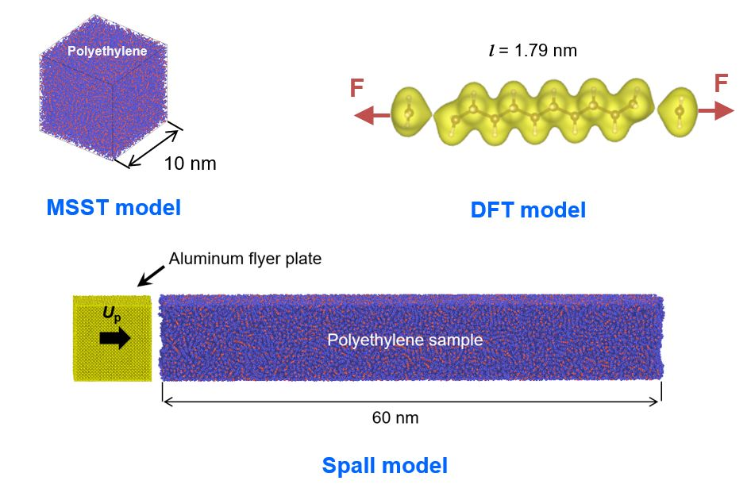

# Molecular Dynamics Study on the Shock Induced Spallation of Polyethylene 

This repository contains the MD (LAMMPS) models and the DFT (VASP) model (shown below), which we used the article [Journal of Applied Physics 131, 025102 (2022)](https://doi.org/10.1063/5.0072249). A video abstract of the article is [available here](https://youtu.be/cUXWU6oaud4).

 

More information on modeling a polymer/metal interface is [available here.](https://github.com/nuwan-d/polymer_metal_interface)
